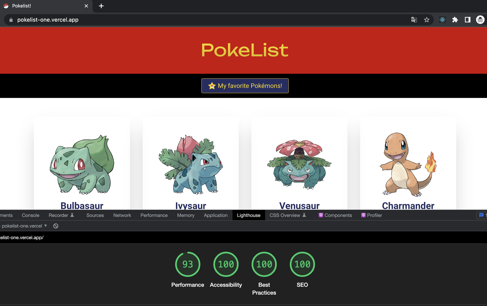

<h1 align="center">
    Pokelist!
</h1>



<p align="center">
  
  <br />
  
  <br />
    
</p>

<p align="center">
    <a href="https://pokelist-one.vercel.app/" target="_blank">Click here to see the live demo!</a>&nbsp;&nbsp;&nbsp;
</p>

## :rocket: Description
Pokelist is a small application made in React + TypeScript that lists Pokémon based on the pokeapi.co API, and let the user favorite Pokémons.
## :rocket: User stories
- User can see a list of Pokémons on the main page;
- User can navigate to other pages;
- User can access the Pokémon details page clicking on the Pokémon on the main page;
- User can insert a Pokémon in a favorites list, in localStorage, clicking on the star button;
- User can leave the tab, come back and see the favorites list with the updated state;
- User can remove a Pokémon from the favorites list clicking on the star when it's active;


## :rocket: How to install:

- git clone: https://github.com/kdumagalhaes/recrutamento-back-end 

```
npm install
```
```
npm start
```

## :rocket: How to test:
```
npm run test
```
### :rocket: Requirements:
- Node's latest version installed on your machine.

## :rocket: Technologies

- [ReactJS](https://reactjs.org/)
- [Create React App](hhttps://create-react-app.dev/)
- [TypeScript](https://www.typescriptlang.org/)
- [LocalStorage API](https://developer.mozilla.org/pt-BR/docs/Web/API/Window/localStorage)
- [Styled Components](https://styled-components.com/)
- [React Testing Library](https://testing-library.com/docs/react-testing-library/intro/)
- [React Router](https://reactrouter.com/en/main)
- [Context API](https://reactjs.org/docs/context.html)

## :rocket: Improvement oportunities
- [ ] Update title page based on screen content (React Helmet?);
- [ ] Loading effect on images;
- [ ] Apply reducers;
- [ ] Improve tests with mocks and different approaches; 
- [ ] Improve navigation based on browser history;
- [ ] Improve performance with caching techniques; 

Made with ♥ by Carlos :wave:
